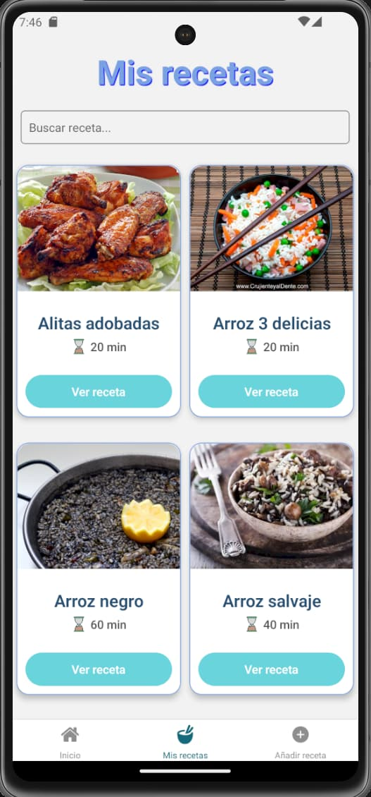
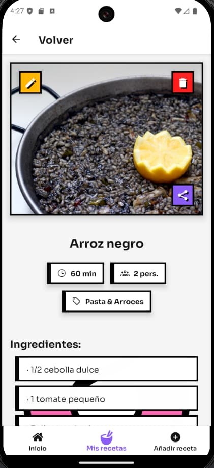
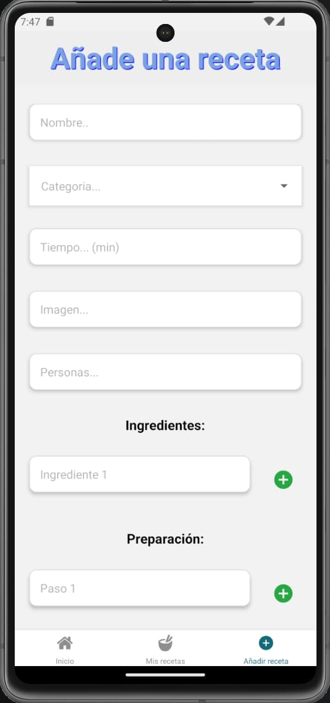

# Que comemos hoy v3.0

## Descripción

Aplicación desarrollada con React-Native que te permite gestionar tus recetas favoritas y crear menús semanales.

Las recetas que se añaden se insertan en una base de datos PostgreSql de Supabase y se sincronizan en tiempo real.

Los menús semanales se guardan en el storage del dispositivo para que sigan disponibles aunque se salga de la aplicación.

## Cómo usar la aplicación

Para usar la aplicación se genera una apk desde expo, se instala en el dispositivo móvil y se ejecuta.

## Capturas

### v 3.0 (pendientes de subir)

<!-- Añade aquí las nuevas capturas de la v3.0 -->
<!-- Ejemplo:

-->

### v 2.0

## Novedades

### v 3.0

- [x] Cambio de estilo a neobrutalista
- [x] Añadida posibilidad de compartir recetas

### v 2.0

- [x] Añadida opción de actualizar receta (hay que crear un input por cada ingrediente y por cada paso)
- [x] Modificada la imagen inicial
- [x] Añadir un input para buscar receta en Mis recetas
- [x] Mejorada la interfaz de formulario de agregar receta
- [x] En la vista Mis recetas se muestran las recetas ordenadas por nombre
- [x] Añadida confirmación para eliminar menú semanal
- [x] En el listado de mis recetas ahora se muestran dos columnas
- [x] Mejoras visuales en todas las vistas
- [x] Gestionar los de la autorización en supabase
