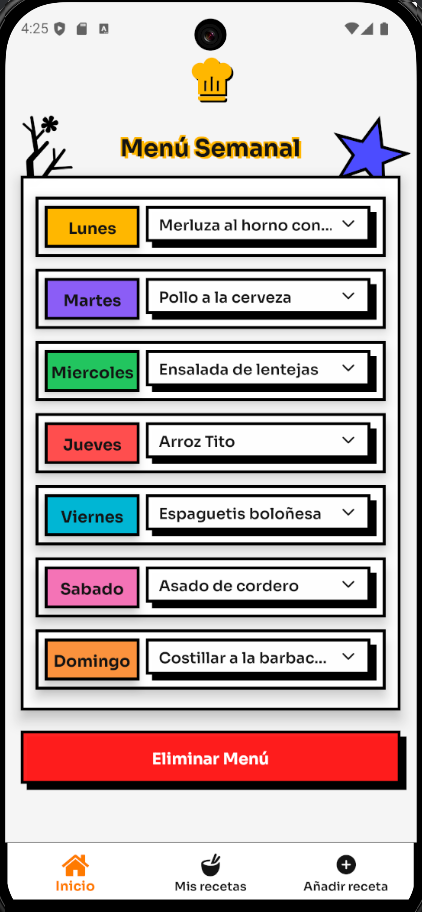
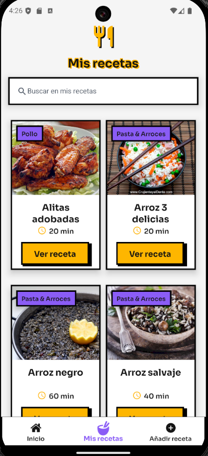

# ¿Qué Comemos Hoy?


Aplicación móvil para gestionar recetas y crear menús semanales con una estética neobrutalista, sincronizada con Supabase y pensada para uso diario.

## Descripción

Esta aplicación, desarrollada con React Native y Expo, te permite gestionar tus recetas favoritas y planificar tu menú semanal de forma sencilla. Las recetas se sincronizan en tiempo real con una base de datos PostgreSQL en Supabase, mientras que el menú semanal se guarda localmente en el dispositivo para un acceso rápido y sin conexión.

## Capturas de Pantalla

<table>
  <tr>
    <td></td>
    <td></td>
  </tr>
  <tr>
    <td></td>
    <td></td>
  </tr>
</table>

## Tabla de Contenidos

- [Características Principales](#características-principales)
- [Stack Tecnológico](#stack-tecnológico)
- [Requisitos](#requisitos)
- [Instalación y Puesta en Marcha](#instalación-y-puesta-en-marcha)
- [Variables de Entorno](#variables-de-entorno)
- [Configuración del Backend (Supabase)](#configuración-del-backend-supabase)
- [Scripts Disponibles](#scripts-disponibles)
- [Builds con EAS](#builds-con-eas)
- [Estructura del Proyecto](#estructura-del-proyecto)

## Características Principales

- **Estilo Neobrutalista:** Interfaz con personalidad y animaciones fluidas.
- **Gestión de Recetas (CRUD):** Crea, lista, actualiza y elimina tus recetas.
- **Menú Semanal:** Planifica tus comidas para la semana. Sincronizado con Supabase y persistente en el dispositivo.
- **Compartir Recetas:** Comparte tus recetas como una imagen o como texto.
- **Búsqueda y Ordenación:** Encuentra fácilmente tus recetas.
- **Tipografías Personalizadas:** *Sora* para la UI y *New Super Mario Font U* para el branding.

## Stack Tecnológico

- **Core:** React Native 0.76.9, Expo 52
- **Navegación:** React Navigation (Bottom Tabs, Native Stack)
- **Backend:** Supabase JS (PostgreSQL)
- **Storage Local:** AsyncStorage
- **UI y Estilos:** Expo Linear Gradient, React Native Animatable, React Native SVG
- **Utilidades:** Expo Sharing, React Native View Shot

## Requisitos

- Node.js (versión LTS recomendada) y npm.
- Una cuenta y un proyecto creado en [Supabase](https://supabase.com/).
- (Opcional) [Expo CLI](https://docs.expo.dev/get-started/installation/) instalado globalmente.

## Instalación y Puesta en Marcha

1.  **Clonar el repositorio (si aplica):**
    ```bash
    git clone https://github.com/tu-usuario/que-comemos-hoy-react-native.git
    cd que-comemos-hoy-react-native
    ```

2.  **Instalar dependencias:**
    ```bash
    npm install
    ```

3.  **Configurar variables de entorno:**
    Crea un archivo `.env` en la raíz del proyecto y añade tus claves de Supabase. (Ver sección [Variables de Entorno](#variables-de-entorno)).

4.  **Iniciar el proyecto:**
    ```bash
    npm run start
    ```
    Esto iniciará el servidor de desarrollo de Expo. Desde ahí, puedes escanear el código QR con la app de Expo Go en tu dispositivo móvil o ejecutar la app en un emulador.

## Variables de Entorno

El archivo `.env` es necesario para conectar con Supabase. Debe contener las siguientes claves:

```env
EXPO_PUBLIC_SUPABASE_URL=tu-url-de-supabase
EXPO_PUBLIC_SUPABASE_ANON_KEY=tu-clave-anon-de-supabase
```

Estas variables son consumidas a través del plugin `react-native-dotenv`, configurado en `babel.config.js`.

## Configuración del Backend (Supabase)

El proyecto requiere dos tablas en tu base de datos de Supabase:

1.  **Tabla `recipes`:**
    - **Campos sugeridos:** `id` (uuid), `name` (text), `category` (text), `time` (int), `image` (text/url), `people` (int), `ingredients` (json), `preparation` (text).
    - **Referencia en código:** `data/api.js` (`getRecipes`, `saveRecipe`, etc.).

2.  **Tabla `weekly_menus`:**
    - **Campos:** `id` (text, usando el día: "lunes", "martes", etc.), `menu_data` (json).
    - **Referencia en código:** `data/api.js` (`obtenerMenuSemanal`, `actualizarRecetaDelDia`).

## Scripts Disponibles

Puedes usar los siguientes scripts de `npm` para el desarrollo:

```bash
# Inicia el servidor de desarrollo de Expo
npm run start

# Inicia la app en un emulador de Android
npm run android

# Inicia la app en un simulador de iOS
npm run ios

# Ejecuta la app en el navegador web
npm run web

# Revisa errores de estilo con ESLint
npm run lint

# Intenta corregir errores de estilo automáticamente
npm run lint:fix
```

## Builds con EAS

El archivo `eas.json` está configurado para crear builds de la aplicación usando [Expo Application Services (EAS)](https://docs.expo.dev/build/introduction/).

**Ejemplo para crear un APK para Android:**
```bash
eas build -p android --profile preview
```

Existen otros perfiles como `preview2`, `preview3`, `preview4` y `production` para diferentes tipos de builds (development client, internal distribution, etc.).

## Estructura del Proyecto

```
.
├─ assets/         # Imágenes, fuentes y otros recursos estáticos
├─ components/     # Componentes reutilizables de la UI
├─ data/           # Lógica de API y conexión con Supabase
├─ screens/        # Pantallas principales de la aplicación
├─ utils/          # Funciones de utilidad, configuración de Supabase y temas
├─ App.js          # Punto de entrada principal de la app
└─ Navigation.js   # Configuración de la navegación (Tabs y Stacks)
```