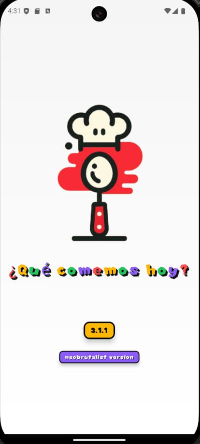

# Que comemos hoy v3.1.1

## Descripción

Aplicación desarrollada con React-Native que te permite gestionar tus recetas favoritas y crear menús semanales.

Las recetas que se añaden se insertan en una base de datos PostgreSql de Supabase y se sincronizan en tiempo real.

Los menús semanales se guardan en el storage del dispositivo para que sigan disponibles aunque se salga de la aplicación.

## Cómo usar la aplicación

Para usar la aplicación se genera una apk desde expo, se instala en el dispositivo móvil y se ejecuta.

## Capturas

### v 3.0 

## Novedades

### v 3.0

- [x] Cambio de estilo a neobrutalista
- [x] Añadida posibilidad de compartir recetas
